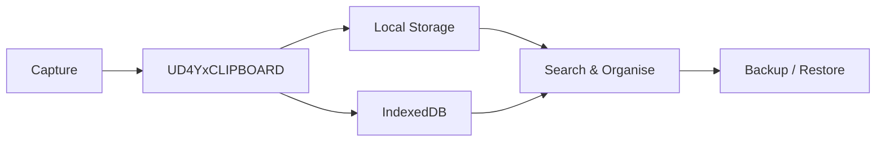

# clipnest

### Your pocket board for everything worth keeping.

**Paste it. Tag it. Find it.**

Save notes, links, ideas, and snippets in one lightweight board.

No account. No sign-up. No backend.

<p align="center">

[](https://developer.mozilla.org/en-US/docs/Web/HTML)
[](https://developer.mozilla.org/en-US/docs/Web/CSS)
[](https://developer.mozilla.org/en-US/docs/Web/JavaScript)
[](https://pages.github.com/)
[](#tech)
[](#tech)
[](#privacy)

</p>

<p align="center">

**Live Demo:** `https://YOUR-USERNAME.github.io/UD4YxCLIPBOARD/`

</p>

## Why?

Links get buried. Notes get scattered. Useful snippets disappear.

**UD4YxCLIPBOARD puts them all in one place.**

```text
CAPTURE  →  ORGANISE  →  SEARCH  →  FIND
```

## Features

|                   |                                                 |
| ----------------- | ----------------------------------------------- |
| **Quick Capture** | Notes, links, clipboard paste, multi-link paste |
| **Smart Links**   | Favicon, domain detection, duplicate handling   |
| **Organisation**  | Tags, search, filters, pins, card colours       |
| **Editing**       | Edit, copy, delete and undo                     |
| **Responsive**    | Desktop, mobile, light and dark themes          |
| **Local-First**   | localStorage + IndexedDB                        |
| **Backup**        | Export and restore as JSON                      |
| **Keyboard**      | Shortcuts for capture and search                |

## How It Works



Everything is handled inside your browser.

## Privacy

* No account
* No backend
* No analytics
* No ads
* No server-side database
* Saved notes stay on your device

External services are used only for **Google Fonts** and **website favicons**.

> Clear your browser data or switch devices and your board won't come with you. **Use Backup for anything important.**

## Shortcuts

```text
Enter        Save
Shift + Enter New line
Ctrl + V     Save clipboard
n            New note
/ or Ctrl + K Search
Esc          Clear / Cancel
?            Shortcuts
```

Use `Cmd` instead of `Ctrl` on macOS.

## Tech

<p align="center">

[](https://developer.mozilla.org/en-US/docs/Web/HTML)
[](https://developer.mozilla.org/en-US/docs/Web/CSS)
[](https://developer.mozilla.org/en-US/docs/Web/JavaScript)
[](#tech)
[](#tech)

</p>

* Plain HTML, CSS and JavaScript
* Single `index.html`
* Zero dependencies
* Zero build tools
* Responsive masonry layout
* GitHub Pages ready
* User text escaped before rendering

## Run Locally

```bash
git clone https://github.com/YOUR-USERNAME/UD4YxCLIPBOARD.git
```

Open `index.html` in your browser.

That's it.

## Deploy

1. Create a repository named `UD4YxCLIPBOARD`
2. Upload `index.html`
3. Open **Settings → Pages**
4. Select **Deploy from a branch → main → `/ (root)`**
5. Open your GitHub Pages URL

## Roadmap

* Folders / multiple boards
* Search match highlighting
* Markdown export
* Optional passcode lock

## Credits

**Built by UDAY**

> Small app. Zero backend. Surprisingly useful.

<p align="center">

**© 2026 UDAY**

</p>
