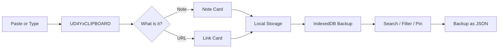
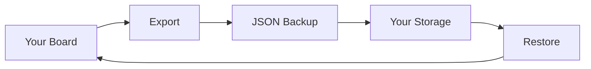
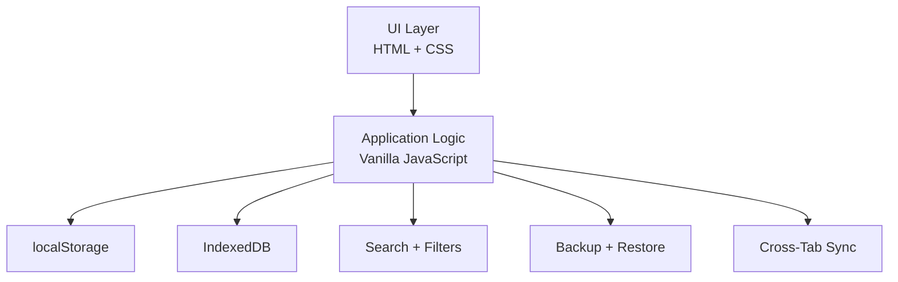

# UD4YxCLIPBOARD

### Your pocket board for everything worth keeping.

**Paste it. Tag it. Find it.**

Save short notes, links, ideas, snippets, and anything you want to find again.

No account. No sign-up. No backend.

[](https://developer.mozilla.org/en-US/docs/Web/HTML)
[](https://developer.mozilla.org/en-US/docs/Web/CSS)
[](https://developer.mozilla.org/en-US/docs/Web/JavaScript)
[](https://pages.github.com/)
[](#tech)
[](#tech)
[](#how-your-data-is-handled)
[](#credits)

> **One board for the stuff you don't want to lose.**

**Live Demo:** `https://YOUR-USERNAME.github.io/UD4YxCLIPBOARD/`

## Why UD4YxCLIPBOARD?

Your links are in WhatsApp.

Your notes are in another app.

Your snippets are somewhere else.

And when you actually need something:

**Where did I save that?**

UD4YxCLIPBOARD keeps everything in one lightweight board.

```text
CAPTURE  →  ORGANISE  →  SEARCH  →  FIND
```

No server. No account. Your data stays in your browser.

## Features

### Fast Capture

* **Enter** to save a note or link
* Paste a URL and automatically create a link card
* **Ctrl + V anywhere** on the page to save clipboard content
* Paste multiple links on separate lines
* Saving an existing link moves it to the top instead of creating a duplicate
* Half-written drafts survive a refresh

### Simple Organisation

* Use `#idea`, `#work`, `#study` and other tags directly inside notes
* Instant search across all cards
* Filter by **All**, **Notes**, **Links**, and **Pinned**
* Pin important cards
* Four card colours for visual organisation
* Edit and copy cards
* Delete with **Undo**

### Responsive by Design

**Desktop**

Sticky capture sidebar with a wide masonry board.

**Mobile**

Single-column layout with large touch targets and a floating add button.

**Themes**

Light and dark modes.

## How It Works



Everything happens locally in the browser.

There is no application server handling your notes.

## Local-First Storage

UD4YxCLIPBOARD uses two browser storage layers:

```text
                    UD4YxCLIPBOARD
                           |
              +------------+------------+
              |                         |
        localStorage               IndexedDB
              |                         |
              +------------+------------+
                           |
                    Browser Device
```

A live status indicator shows whether the application can currently save data.

If saving fails, the status changes to warn you instead of silently pretending everything is fine.

Multiple open tabs also stay in sync.

## Backup & Restore

Your data belongs to you.

Use the built-in backup feature to export your board as a JSON file.



This gives you a portable copy that you control.

## Privacy

UD4YxCLIPBOARD does not require an account or backend.

* No account
* No sign-up
* No cookies
* No analytics
* No advertisements
* No server-side database
* No upload of your saved notes

Your saved data stays inside your browser.

Two external services are used only for presentation:

* **Google Fonts** for typography
* **Google Favicon service** for website icons on link cards

Because the application is local-first, clearing browser site data, switching browsers, or moving to another device starts with an empty board.

**For anything important, keep a backup.**

## Keyboard Shortcuts

```text
Enter       → Save note / link
Shift+Enter → Add a new line
Ctrl+V      → Save clipboard
n           → Focus new note
/           → Open search
Ctrl+K      → Open search
Esc         → Clear search / cancel edit
?           → Open shortcuts
```

On macOS, use `Cmd` instead of `Ctrl`.

## Tech

Built intentionally without a framework.

[](https://developer.mozilla.org/en-US/docs/Web/HTML)
[](https://developer.mozilla.org/en-US/docs/Web/CSS)
[](https://developer.mozilla.org/en-US/docs/Web/JavaScript)
[](#tech)
[](#tech)

* Plain HTML, CSS and JavaScript
* Single `index.html`
* Zero dependencies
* Zero build tools
* GitHub Pages ready
* Responsive masonry layout
* Bagel Fat One + Familjen Grotesk
* User text escaped before rendering

### Architecture



## Edge Cases

The app also handles the less obvious stuff:

* IME input such as Hindi and other on-screen keyboards does not trigger premature saves
* Corrupted saved data is cleaned up instead of crashing the application
* Very long URLs and words wrap inside cards
* Clipboard pasting is ignored while a popup is open
* Resizing the browser while editing does not wipe the current text

## Run Locally

Clone the repository:

```bash
git clone https://github.com/YOUR-USERNAME/UD4YxCLIPBOARD.git
```

Open:

```text
index.html
```

That's it.

No installation.

No `npm install`.

No `node_modules`.

No build step.

## Deploy to GitHub Pages

Create a repository named:

```text
UD4YxCLIPBOARD
```

Upload `index.html` to the repository root.

Then open:

**Settings → Pages → Deploy from a branch → main → `/ (root)`**

Your application will be available at:

```text
https://YOUR-USERNAME.github.io/UD4YxCLIPBOARD/
```

## Roadmap

Potential future additions:

* Folders and multiple boards
* Highlighted search matches
* Markdown export
* Optional passcode lock

The goal is to keep the app useful without turning a simple clipboard board into another complicated productivity platform.

## Credits

Built by **UDAY**

> **Small app. Zero backend. Surprisingly useful.**

**© 2026 UDAY**
